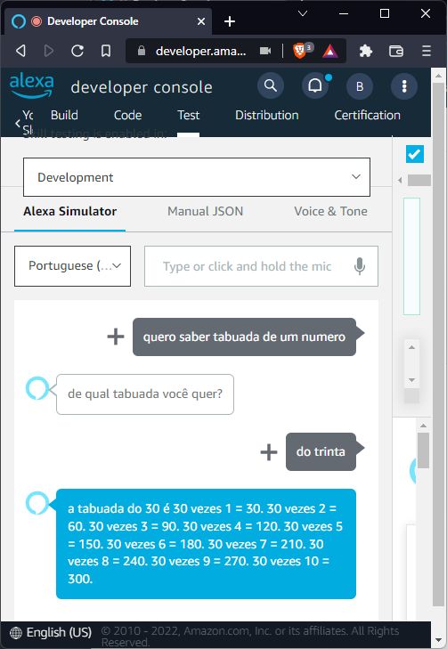

# Aplicativo de Tabuada na alexa 

Tecnologia utilizada:
- [Amazon Alexa](https://www.alexa.com/)
- [Node.js](https://nodejs.org/)

Este aplicativo foi desenvolvido com o objetivo de testar a funcionalidade de Skills da Amazon Alexa.
## Teste 
Pedindo para a alexa retornar a tabuada de 30.



## Função Tabuada

```javascript
const TabuadaIntentHandler = {
    canHandle(handlerInput) {
      return (
        Alexa.getRequestType(handlerInput.requestEnvelope) === "IntentRequest" &&
        Alexa.getIntentName(handlerInput.requestEnvelope) === "TabuadaIntent"
      );
    },
    handle(handlerInput) {
      const number =
        handlerInput.requestEnvelope.request.intent.slots.number.value;
      let speakOutput = "a tabuada do " + number + " é ";
  
      for (let i = 0; i < 10; i++) {
        const j = i + 1;
        const result = number * j;
        speakOutput += `${number} vezes ${j} = ${result}.\n`;
      }
  
      return (
        handlerInput.responseBuilder
          .speak(speakOutput)
          //.reprompt('add a reprompt if you want to keep the session open for the user to respond')
          .getResponse()
      );
    },
  };
```


